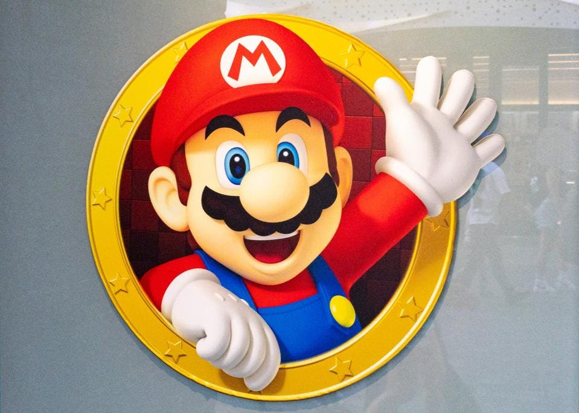
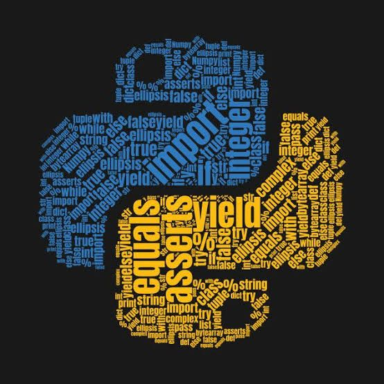

# MarioBot: SuperMario Game Playing Agent

<p align="center">
  
  
</p>


## Project Overview
MarioBot is an autonomous agent developed to play the classic Super Mario game using reinforcement learning and computer vision techniques. The agent interacts with the game environment to make intelligent decisions that allow it to complete levels, avoid obstacles, and improve its performance through continuous learning.

## Features
1. Gym-Super-Mario-Bros Environment: The agent interacts with a modified Super Mario environment based on the OpenAI Gym framework.

2. Reinforcement Learning (RL): Utilizes RL algorithms to train the agent to play the game effectively.
3. Neural Network Integration: A deep neural network is used for learning optimal policies.
4. OpenCV Integration: Includes real-time video processing for monitoring the game.
5. Replay Generation: Automatically generates gameplay clips during the training process.

## Installation

### Prerequisites
To run this project, you need to have Python 3.10 or higher installed on your machine.

#### First Clone this repository
```
git clone https://github.com/Vinayak-Pawar/MarioBot-SuperMario-Game-Playing-Agent.git
```
```
conda create --name mario_learn python=3.10.12
```
#### Dependencies
All required dependencies are listed in requirements.txt. Install them using:
```bash
pip install -r requirements.txt
```

Major dependencies include:

* gym-super-mario-bros: Environment for Super Mario gameplay.
* torchrl: Reinforcement learning library.
* opencv-python: Used for video processing.
* moviepy: For generating gameplay videos.
* And more... (see requirements.txt for full details).

### Files

* agent.py: Contains the implementation of the agent, including neural network and policy training.
* main.py: The main entry point of the project. Trains the agent using the specified configurations.
* generate_clips.py: Script to generate and save gameplay clips after training.
* utils.py: Utility functions for data processing, normalization, and other helper methods.
* wrappers.py: Contains wrappers for modifying the environment (e.g., resizing frames, setting rewards).
* requirements.txt: List of required Python packages​(requirements).
* Media Files: Short Recordings of the program running.

### How to Run: 

1. **Clone the Repository** Clone the repository and navigate to the project directory: 

``` 
git clone https://github.com/Vinayak-Pawar/MarioBot-SuperMario-Game-Playing-Agent.git
cd MarioBot-SuperMario-Game-Playing-Agent
```
2. **Install Dependencies** Install the required Python packages:
``` 
pip install -r requirements.txt
```
3. **Train the Agent** Run the main.py file to start training the MarioBot agent:
```
python main.py
```
4. **Generate Gameplay Clips** After training, use generate_clips.py to generate video clips of the agent's performance:

```
python generate_clips.py
```

### Media

The First Hurdle Occured and AI Agent trying to learn how to jump and pass the pipe.

[](https://www.youtube.com/watch?v=wB4-_LuuY5o)


here as you can see the AI Agent trying to pass the hurdles in a way as it is occuring 


[](https://youtu.be/xsnPpyd7PiY)

## Acknowledgements

This project is based on the Gym Super Mario Bros environment and uses several open-source libraries for reinforcement learning and video processing.

## License 

This project is licensed under the MIT License.